# Post-Analysis Results: Urban–Freeway Integrated MPC / Stackelberg Controller

Date: 2026-06-23

## 실험 설정

- 시뮬레이션: 3600 s(1 h) = 20 control steps(control_interval 180 s), deterministic plant·demand
  (`random_seed`/`np.random` 미사용 → seed 무관 재현, 분산은 시나리오로 확보).
- 컨트롤러: `NO-CONTROL`, `WU-CD-F`(P-WU, 문헌형 분산 green/VSL), `PROPOSED-FOLLOWERS-ONLY`(PFO,
  경량 분산 MPC), `PROPOSED-STACKELBERG`(P-Stack, 계층 게임 MPC). P-Stack: `direct` allocation,
  **fallback OFF(P-Stack 단독)**, reachability-clamp + 예산 튜닝(global 10/local 3).
- 시나리오 8종: medium(1.0) · peak(1.25) · **heavy1.40 · heavy1.50**(순수 고수요, cap 1.0) ·
  oversaturated(1.55,cap 0.92) · incident(1.20,cap 0.72) · **skew-peak · skew-heavy**(공간 비대칭).
  (low_demand 제외 — 저혼잡 단독 leader 회귀, 별도 conditioning 과제.)
- Centralized 제외(진단 결과 진짜 상한 아님: 다른 objective + budget-제한 flat 탐색 + 차원의 저주).
- 그림: Times New Roman, 수식 표기($N_P$, $N_{UF}$, $N_{P,\mathrm{crit}}$). 원본 `reports/figures/`.

> 두 제안 모드. PFO는 약한 baseline이 아니라 **경량 분산 변형**, P-Stack은 **계층 결합-조정 변형**.
> 본 보고서는 특히 **PFO ↔ P-Stack 차이**를 깊게 다룬다 — 계산량을 더 쓰면서 leader를 두는 근거이기 때문.

---

## 1. 수요 시나리오 특성화

### 시나리오별 수요 (3600 s 적분) 및 no-control 반응

| 시나리오 | 총수요(veh) | peak rate | freeway% | urban% | on/off-ramp% | cap | No-ctrl TTT | No-ctrl 잔류 |
|---|---:|---:|---:|---:|---:|---:|---:|---:|
| medium | 15 940 | 17 132 | 24 | 59 | 17.1 / 2.9 | 1.00 | 536.3 | 830 |
| peak | 19 733 | 21 209 | 23 | 59 | 17.3 / 2.8 | 1.00 | 2 523.2 | 5 790 |
| heavy1.40 | ~22 100 | — | 23 | 59 | ~17.5 / 2.8 | 1.00 | 3 712.9 | — |
| heavy1.50 | ~23 600 | — | 23 | 59 | ~17.7 / 2.7 | 1.00 | 4 227.7 | — |
| oversat | 24 460 | 26 289 | 23 | 59 | 17.9 / 2.7 | 0.92 | 4 496.3 | 9 541 |
| incident | 19 073 | 20 499 | 23 | 59 | 17.9 / 2.8 | 0.72 | 2 264.3 | 5 292 |
| skew-peak | 19 733 | — | 23 | 59 | (peak와 동일 총량) | 1.00 | 2 598.2 | — |
| skew-heavy | ~22 100 | — | 23 | 59 | (heavy1.40과 동일 총량) | 1.00 | 3 852.4 | — |

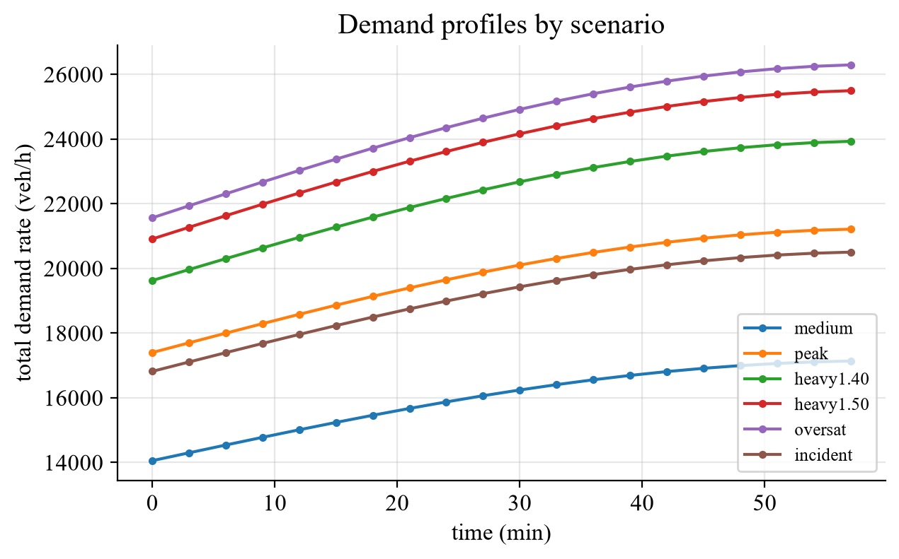
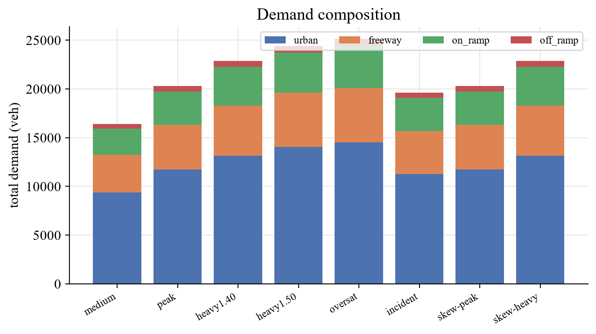

### 수요 구조

- **모든 시나리오 urban-dominant**: urban 경계유입 59 %, freeway 본선 23–24 %, ramp 결합 ~20 %
  (on-ramp 17–18 % + off-ramp 2.7–2.9 %). 구조는 동일, 차이는 **크기**(medium 1.0 → oversat 1.55)와
  **용량**(incident 0.72, oversat 0.92), 그리고 **공간 분포**(skew).
- **공간 비균등 loading(중요)**: urban 경계수요는 게이트별로 균등이 아니라 인덱스 gradient
  `urban_base·(1+0.10·idx)` → 게이트당 **1.0–1.6×** 비대칭. skew 시나리오는 여기에 핫스팟 가중치
  (C_top·C_right·F_right)를 얹고 **총량을 보존(renormalize)** 해 *분포만* 비대칭화한다(Fig.3).

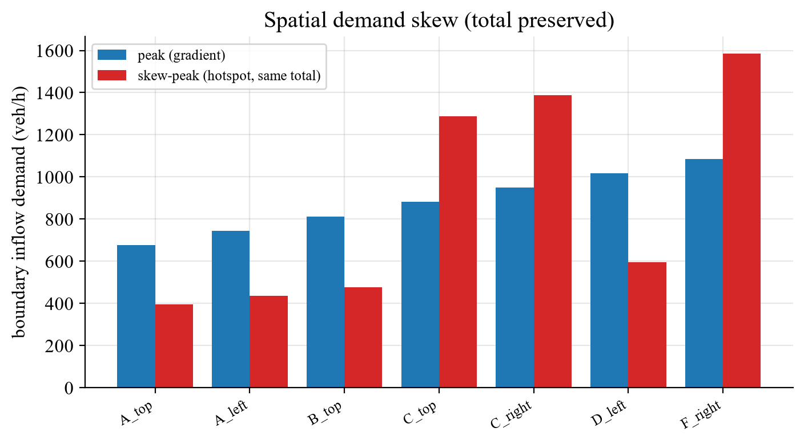

### 분류 (no-control 기준)

| 시나리오 | 성격 | half-cap/MFD engage? |
|---|---|---|
| medium | 통제가능 혼잡 | × (excess 0) |
| peak | 강혼잡(순수 수요) | 거의 × (excess 29) |
| heavy1.40 / 1.50 | **완전 혼잡(순수 수요)** | ○ ($N_P$가 $N_{P,\mathrm{crit}}$ 초과·excess↑) |
| oversat | 수요포화 + 용량저하 | ○ (excess 7640) |
| incident | 사고/용량저하(0.72) | △ (excess 340, VSL 작동) |
| skew-* | 공간 비대칭 | ○ (국소 핫스팟) |

해석 지침: oversat 같은 초고수요는 raw TTT만 보지 말고 throughput·완료·잔류로 평가. 저혼잡(medium)
개선폭이 작은 것은 약함이 아님.

---

## 2. 거시 네트워크 비교

### 주표 (3600 s, TTT improvement vs no-control)

| 시나리오 | P-WU | PFO | **P-Stack** | **P-Stack − PFO (pp)** |
|---|---:|---:|---:|---:|
| medium | 7.8 % | 8.7 % | 8.7 % | **+0.0** |
| peak | 33.8 % | 39.7 % | **53.4 %** | **+13.7** |
| heavy1.40 | 17.7 % | 30.3 % | **40.9 %** | **+10.6** |
| heavy1.50 | 11.8 % | 24.3 % | **33.9 %** | **+9.6** |
| oversat | 9.9 % | 25.5 % | 25.5 % | **+0.0** |
| incident | 37.2 % | 39.9 % | **47.2 %** | **+7.3** |
| skew-peak | 34.4 % | 38.1 % | **49.7 %** | **+11.6** |
| skew-heavy | 19.4 % | 31.7 % | **43.7 %** | **+12.0** |

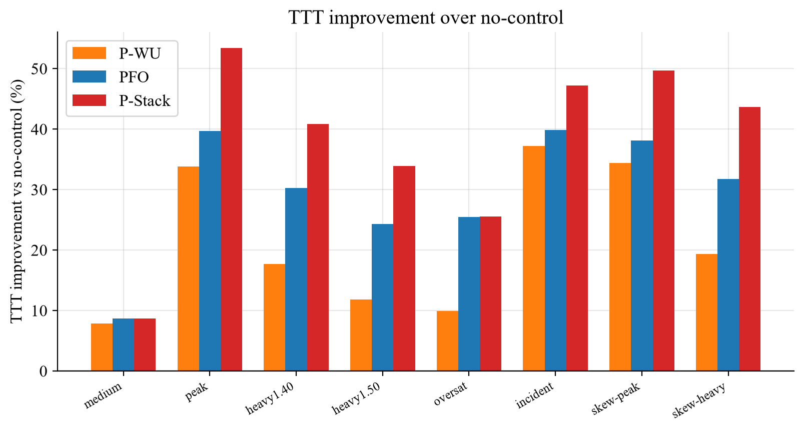
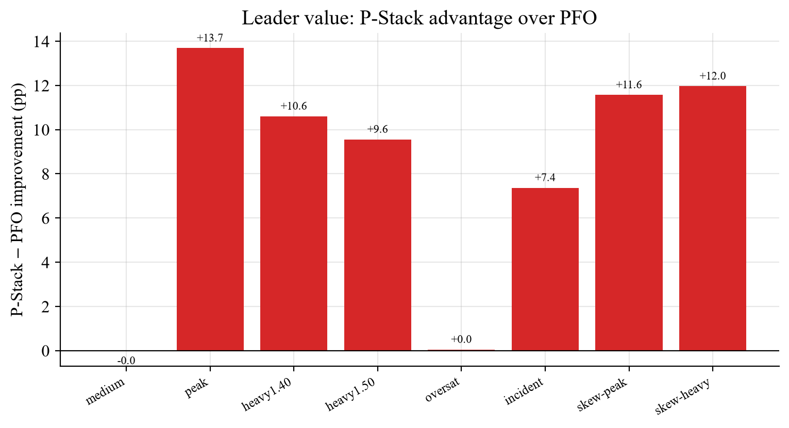

### 해석 — **언제 leader가 가치 있는가** (PFO↔P-Stack)

- **혼잡 + 순수수요/비대칭에서 P-Stack이 PFO를 크게 능가**: peak +13.7, skew-heavy +12.0,
  skew-peak +11.6, heavy1.40 +10.6, heavy1.50 +9.6 pp. → **leader에 계산을 쓰는 직접 근거.**
- **두 극단에서만 동률**(gap 0): (i) **medium**(저혼잡 — 조정할 결합 압력이 없음), (ii) **oversat**
  (수요가 용량을 압도 + cap 0.92 — 물리 병목 지배라 어떤 상위 조정도 여지 작음). 즉 **P-Stack의 이득은
  "결합이 binding하지만 아직 물리적으로 포화되지 않은 중·고혼잡대"에 집중**된다.
- 중요 — oversat에서 gap=0인 건 **수요(1.55) + 용량저하(0.92) confound** 때문이었다. **순수 수요만
  올린 heavy1.40/1.50에서는 같은 혼잡도라도 P-Stack이 +10 pp 이상 우세** → "perimeter가 켜지면
  P-Stack 우위가 사라진다"가 아니라 "물리 병목이 지배할 때만 사라진다".

### discharge vs inflow-suppression (PFO↔P-Stack)

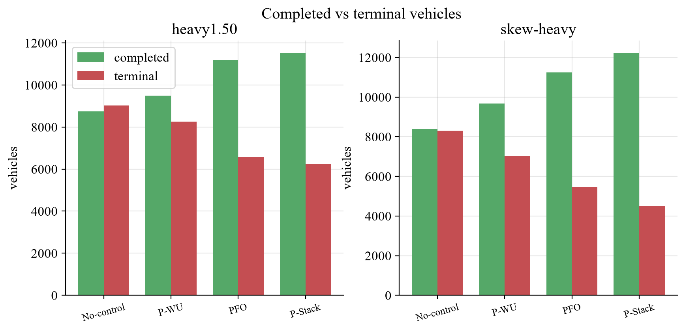
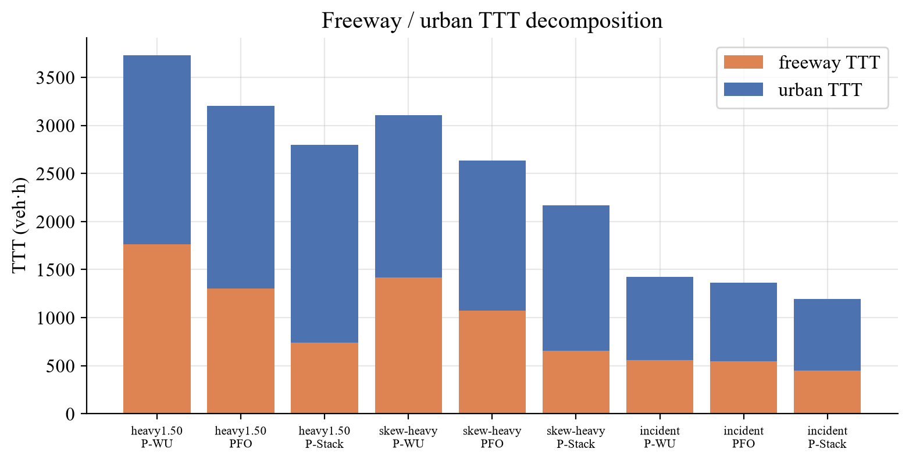

- P-Stack의 우위는 **유입 억제가 아니라 방출 개선**에서 온다: heavy1.50·skew-heavy에서 P-Stack은
  **완료 차량 최다 + 잔류 최소**(Fig.6), **freeway·urban TTT 동시 감소**(Fig.7) — 부담을 한쪽으로
  떠넘기지 않음. PFO도 같은 방향이나 폭이 작다.
- skew-heavy: P-Stack이 freeway·urban 둘 다 PFO보다 낮음 → 비대칭 부하를 양 서브시스템에 걸쳐 재분배.

---

## 3. 미시 제어 메커니즘 (PFO vs P-Stack 심층)

### 3.1 Leader 타겟 — PFO에는 없는 자유도

PFO는 $N_P^{\ast}=N_{UF}^{\ast}=0$(leader 없음). P-Stack은 혼잡에 따라 비자명한 타겟을 *능동* 조정한다(Fig.8):
혼잡 심화 시 $N_P^{\ast}$를 올려(보호영역 방출 우선) $N_{UF}^{\ast}$(ramp 방출 총량)와 함께 네트워크 전역을 조정.
**fallback OFF이므로 이 타겟 효과는 순수 leader 기여** — P-Stack은 PFO로 수렴하지 않는다.

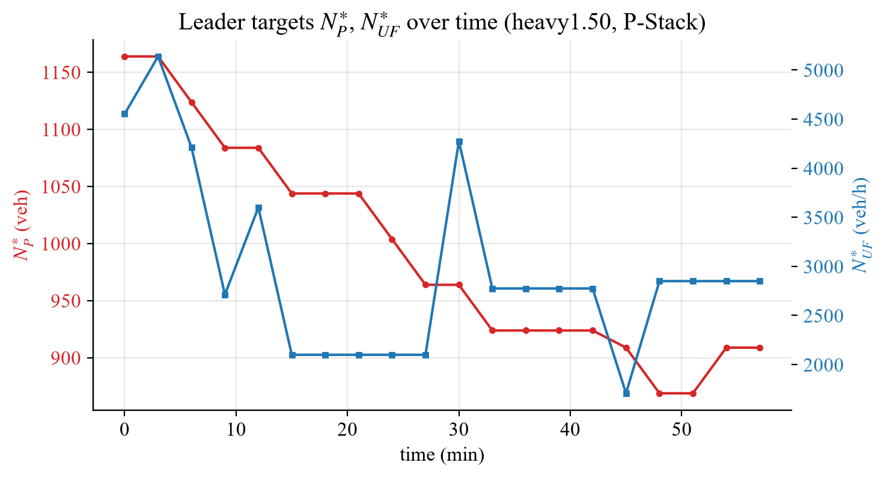
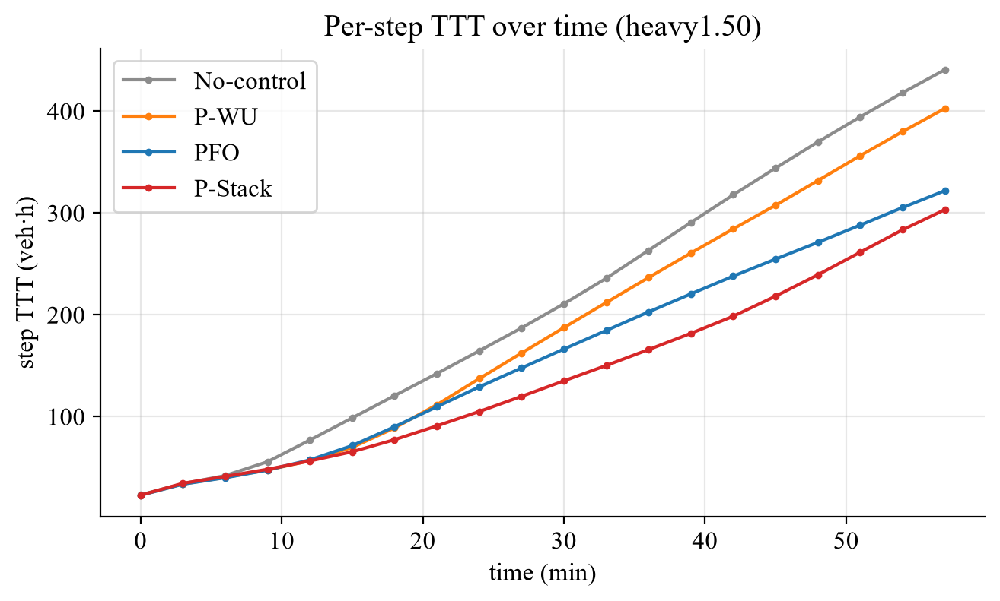

Fig.9: 초반엔 네 제어가 같이 가다 혼잡 누적(~25–35분) 후 **P-Stack의 step TTT가 확연히 꺾인다**(PFO보다
낮게 유지). 즉 leader의 사전 조정이 혼잡 *축적 단계*에서 효과를 낸다.

### 3.2 Green time — 평균이 아니라 *배분*을 봐야 한다

green 평균은 의미 없다(모든 신호 $g_{p1}+g_{p2}=$ cycle$-$lost로 고정 → 평균은 ≈ cycle/2 상수). 대신
**green split**($g_{p1}-g_{p2}$)이 **queue split**($Q_{p1}-Q_{p2}$)에 얼마나 결합되는지 본다.

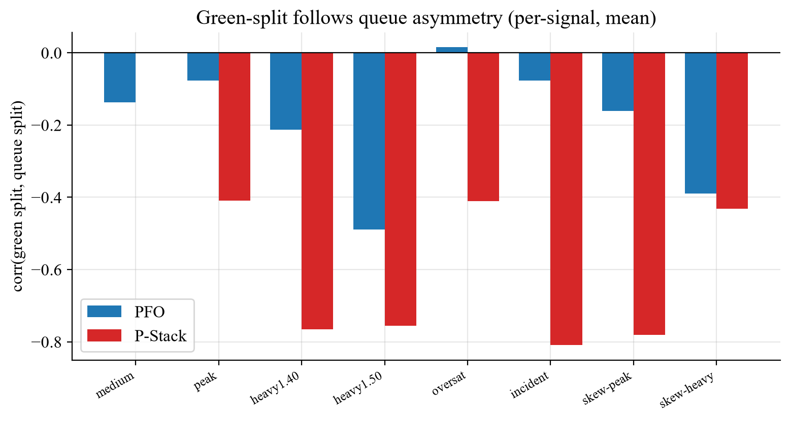
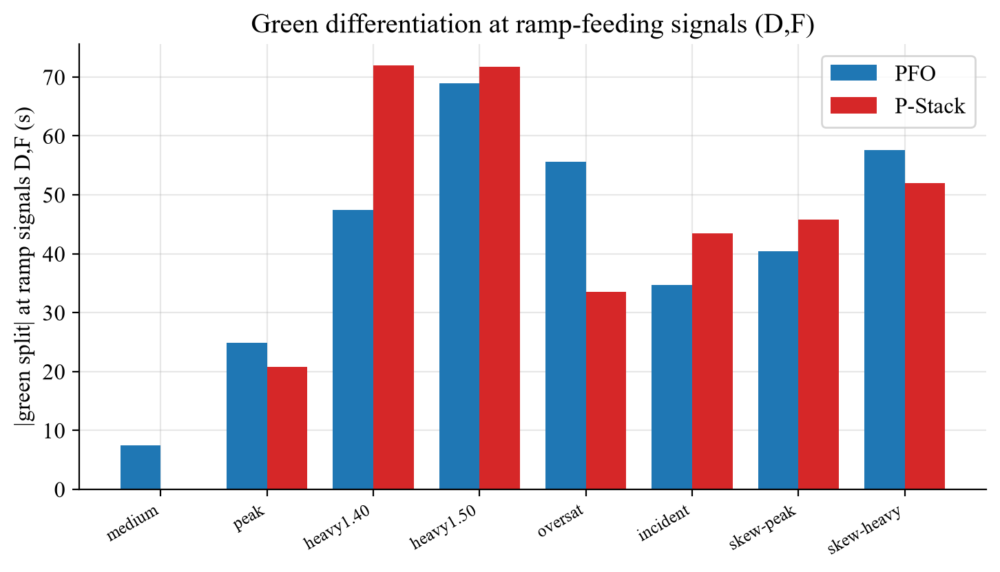

| 시나리오 | corr(green split, queue split) PFO | **P-Stack** |
|---|---:|---:|
| peak | −0.08 | **−0.41** |
| heavy1.50 | −0.49 | **−0.76** |
| skew-peak | −0.16 | **−0.78** |
| skew-heavy | −0.39 | **−0.43** |

- 부호가 음(−)인 것은 **유효 제어의 신호**다: green을 더 받은 phase는 *그 결과* 잔류 큐가 낮다(green이
  비워냄) → 동시점에서 high green ↔ low queue. 즉 |corr|이 클수록 **green을 결정적으로 배분해 큐를
  실제로 해소**한다는 뜻.
- **P-Stack의 |corr|이 모든 구간에서 PFO보다 크다**(특히 skew-peak −0.78 vs −0.16). → **공간 비대칭에서
  P-Stack은 막힌 phase로 green을 훨씬 결정적으로 재배분**하지만 PFO는 거의 못 한다. 이것이 skew에서
  P-Stack이 +11~12 pp 앞서는 미시 기전.
- **ramp-feeding 신호(D,F) green 차등이 비-ramp(A,B,C)의 ~2배**(skew-heavy: D,F 57.6 vs A,B,C 28.6 [PFO],
  52.0 vs 33.0 [P-Stack]; Fig.11) → green이 ramp 결합 수요를 향해 구조적으로 배분됨.

### 3.3 Ramp metering & VSL (freeway 보호 채널의 차이)

- **Ramp metering**: 두 제어 모두 능동(혼잡 시 조임). 단 P-Stack은 leader $N_{UF}^{\ast}$로 *전역* 방출량을
  조정해 per-ramp 국소 반응을 균일화(§4 참조).
- **VSL**(Fig.16): medium·peak·heavy·oversat에서는 **모든 제어가 100 km/h(비활성)** — 자유류 유지가
  최적이고 본선이 capacity-drop에 빠지지 않기 때문. **VSL은 incident(용량 0.72)에서만 작동**하는데,
  거기서 **WU·PFO는 VSL을 50까지 내려 본선을 보호**하지만 **P-Stack은 VSL=100을 유지하고 ramp
  metering을 더 낮춰(+ $N_{UF}^{\ast}$ 축소) 대체**한다. 즉 **freeway 보호를 PFO/WU=VSL, P-Stack=metering+
  leader target 이라는 *다른 채널*로 푼다** — 그리고 incident에서 P-Stack이 +7.3 pp 더 좋다.

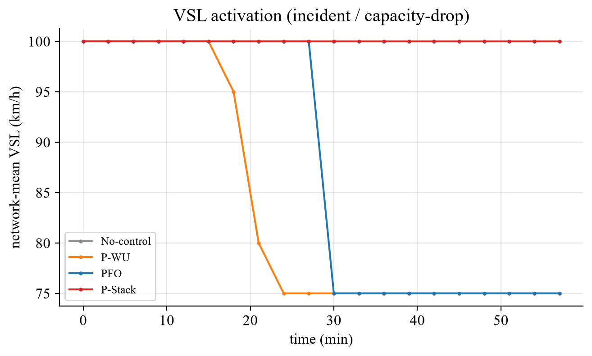

---

## 4. urban–freeway 결합(coupling)의 다층 분석

도시–고속도로 결합(van den Berg et al., 2007 [4])은 관찰 level에 따라 다르게 나타난다.

### 4.1 Ramp-level (미시) — PFO에서 어떤 제어가 켜지나

단일 ramp의 국소 사슬: *도시 green이 on-ramp 접근부 방출 → on-ramp 큐↑ → 본선 밀도↑ → ramp metering↓
(본선 보호) → on-ramp 큐가 지연 흡수*. PFO에서 각 ramp의 **corr(on-ramp 큐, metering) ≈ −0.5**
(큐↑ → metering 조임; ALINEA식 본선보호 [2]와 같은 방향, 단 밀도 규칙이 아닌 TTT-호환 평가). off-ramp도
대칭: 유출이 storage를 채우고 하류 green 부족 시 본선으로 역압.

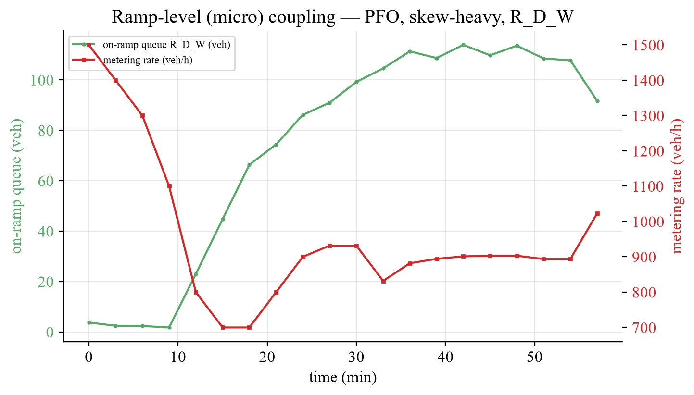

### 4.2 Network-level (거시) — 시스템 현상

미시의 "본선 보호용 ramp 적체"가 4 ramp + 경계에서 동시에 일어나면, 거시적으로는 **지연을 본선에서
ramp/도시 저장부로 옮겨 본선 throughput을 지키는** 현상이 된다(perimeter/MFD 원리 [1,3]). 이를
leader가 실제로 벌점화하는 양 — **half-cap storage 초과분**(요소별 50 % storage 초과, $\ge 0$) — 으로
평가한다. heavy1.50에서 이 초과분은 ~36분부터 engage해 6,300 veh까지 단조 증가한다(Fig.14). 즉
고수요대에서 perimeter/MFD 기전이 작동한다. 이 항은 leader objective를 가진 P-Stack에만 존재한다
(no-control은 leader 부재, PFO는 leader objective 부재). 참고로 보호영역 누적 $N_P$ 자체는 leader가
직접 추종하지 않으므로(setpoint 항 off) 그림에서 제외했고, $N_{P,\mathrm{crit}}$은 production-정점
참조값일 뿐이다.

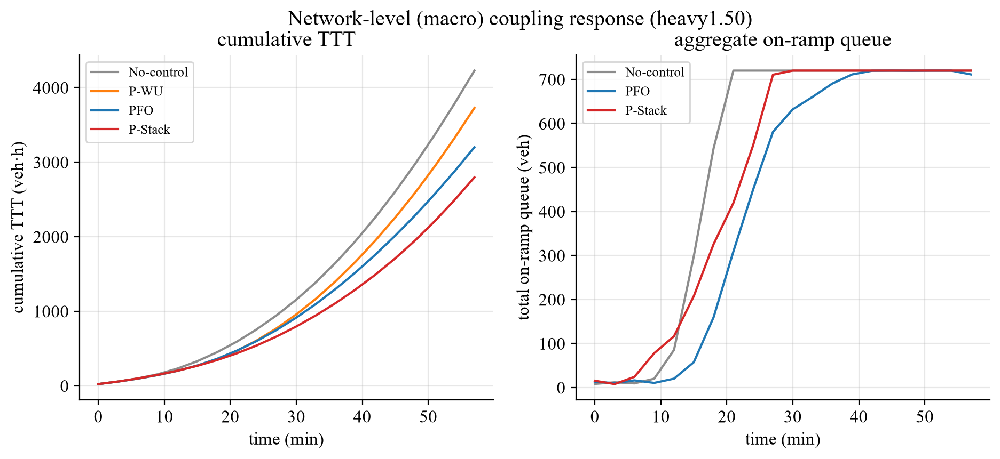
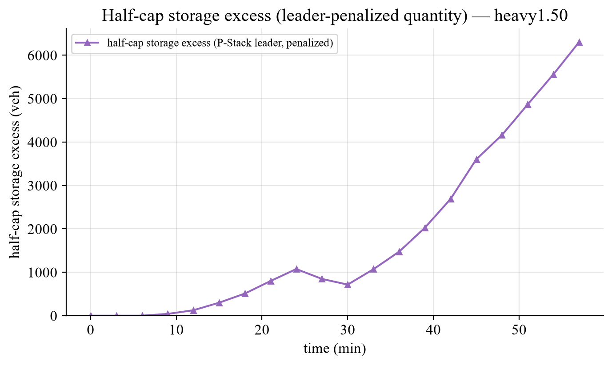

### 4.3 미시 결합 vs 거시 결합 — 핵심 차이 (PFO↔P-Stack)

| 측면 | 미시(ramp-level) | 거시(network-level) |
|---|---|---|
| 단위 | 단일 ramp 큐↔metering↔본선밀도 | 총 throughput·총 큐·freeway/urban 배분 |
| 인과 | 국소·즉각 | 창발·시차 (4 ramp+경계의 합) |
| **PFO** | 각 ramp가 자기 큐에 국소 반응 | 국소 최적의 *합* — 조정 안 됨 |
| **P-Stack** | leader가 per-ramp 반응을 균일화 | $N_{UF}^{\ast}/N_P^{\ast}$로 **전역 재분배 조정** |

**핵심.** PFO의 per-ramp metering은 국소적으로 최적이지만 **국소 최적의 합 ≠ 네트워크 최적**이다.
P-Stack의 leader는 per-ramp 국소 반응을 의도적으로 약화(metering floor 균일화)하고 대신 $N_{UF}^{\ast}$
(총 ramp 방출)·$N_P^{\ast}$(보호영역 누적)이라는 **거시 결합 변수를 직접 조정**한다 → 거시에서만 보이는
이득(throughput↑, 잔류↓, freeway·urban 동시 감소)을 얻는다. 이것이 **follower(PFO)가 볼 수 없는 네트워크
equilibrium을 leader가 internalize**하는 Stackelberg 구조의 본질[5].

### 4.4 공간 비대칭(skew) — leader 재분배가 가장 빛나는 곳

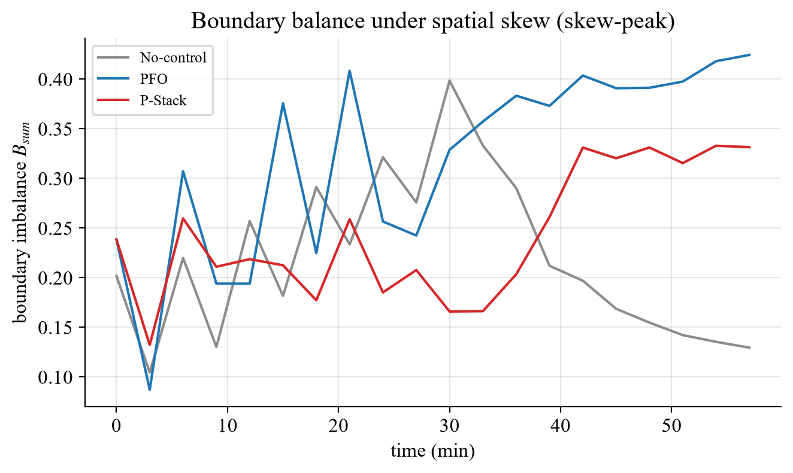

- skew에서 **P-Stack 우위가 최대**(+11.6 / +12.0 pp). 게다가 **경계 불균형이 더 낮다**: skew-peak
  $B_{sum}$ = **0.243(P-Stack) vs 0.320(PFO)** (Fig.15) — leader가 한쪽으로 쏠린 부하를 perimeter 타겟으로
  *재분배*해 균형까지 개선. PFO는 비대칭에 국소적으로만 반응해 불균형을 더 키운다. **공간 비대칭이
  클수록 leader의 거시 조정 가치가 커진다**는 직접 증거.

---

## 5. 계산 실용성·실시간성

| 컨트롤러 | 계산(s, 3600 s) | real-time 비 | 비고 |
|---|---:|---:|---|
| P-WU | ~96 | 0.027 | green+VSL 저차원 |
| PFO | ~150 | 0.042 | green/offset/ramp/VSL TTT-호환 평가 |
| P-Stack | ~1250 | 0.35 | leader 후보마다 follower 응답 평가(PFO의 ~8×) |

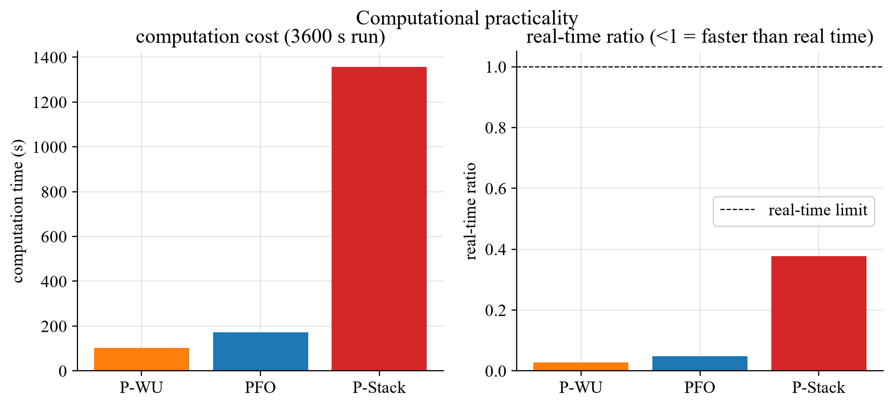

- 세 제어 모두 **real-time 비 < 1**(180 s 주기 실시간 가능). P-Stack이 가장 무겁다(PFO ~8×).
- P-Stack은 이미 경량화 적층(1800 s마다만 global 탐색, 그 외 trust-region, sensitivity 방향, feasibility
  pre-check, incumbent 조기종료, follower grid process 병렬) + 본 연구의 process 병렬·reachability 축소·
  예산 분리로 누적 ~2.6× 단축. **매 스텝 full-grid가 아니다.**
- **트레이드오프 결론.** PFO = 실시간성 우수 + 강한 분산 성능. **P-Stack = 8× 계산을 쓰는 대신, 혼잡·
  비대칭에서 +10~14 pp TTT 개선 + throughput↑·잔류↓·경계균형↑** — §2–§4가 보인 PFO 대비 차이가 곧
  그 계산량을 정당화한다. 운영상 **혼잡/사고/비대칭 시간대 P-Stack, 평시 PFO**의 모드 전환이 현실적.

---

## 부록: robustness/구현 검증 (본문 외)

- **fidelity**: 선택 제어 `leader_follower_ttt_base` vs 실제 3-step plant TTT 상관 0.9999. candidate ranking ==
  rollout ranking. 선택-행동 회계 충실.
- **allocation on/off**: pso·simplified(결정론) 모두 direct보다 열위(강제 net-inflow 추종이 follower 자기절제
  제거 → 과유입 핀). direct 채택.
- **search budget**: global max_evals=10이 25와 동일 setpoint·objective. **horizon**: 3→4→5 개선 없음
  (penalty가 terminal-cost 가드). **seed**: deterministic → 분산은 시나리오로 확보.
- **알려진 한계**: low_demand 단독 P-Stack 회귀(−21 %) — 저혼잡에서 불필요한 setpoint 강제(fallback ON
  또는 저혼잡 conditioning으로 해결 가능).

---

## 그림 목록 (`reports/figures/`)

| # | 파일 | § | 내용 |
|---|---|---|---|
| 1 | fig01_demand_profiles | 1 | 시나리오별 수요율 |
| 2 | fig02_demand_composition | 1 | 수요 구성(urban/freeway/on·off-ramp) |
| 3 | fig03_skew_demand | 1 | 공간 skew(총량 보존) |
| 4 | fig04_improvement | 2 | 개선율 8시나리오×3제어 |
| 5 | fig05_pstack_pfo_gap | 2 | **P-Stack − PFO 격차(leader 가치)** |
| 6 | fig06_throughput_terminal | 2 | 완료 vs 잔류 |
| 7 | fig07_freeway_urban | 2 | freeway/urban TTT 분해 |
| 8 | fig08_leader_targets | 3 | $N_P^{\ast}/N_{UF}^{\ast}$ 궤적 |
| 9 | fig09_step_ttt | 3 | step TTT 발산 |
| 10 | fig10_green_queue_align | 3 | green-split↔queue-split 결합 |
| 11 | fig11_ramp_green | 3 | ramp-feeding green 차등 |
| 12 | fig12_coupling_micro | 4 | ramp-level 미시 결합 |
| 13 | fig13_coupling_macro | 4 | network-level 거시 결합 |
| 14 | fig14_accumulation | 4 | half-cap storage 초과분(leader 벌점 양, P-Stack) |
| 15 | fig15_skew_balance | 4 | skew 하 경계균형 재분배 |
| 16 | fig16_vsl | 3 | VSL 작동(incident) |
| 17 | fig17_computation | 5 | 계산비용·real-time 비 |

(생성: `2026-06-23/diag_scripts/make_paper_figures_v2.py`, Times New Roman + mathtext)

---

## References

[1] Geroliminis & Daganzo, *Existence of urban-scale macroscopic fundamental diagrams*, Transp. Res. B, 2008.
[2] Papageorgiou et al., *ALINEA: a local feedback control law for on-ramp metering*, 1991.
[3] MFD-based MPC perimeter control (accumulation-setpoint gating, network outflow 최대화).
    https://arxiv.org/html/2505.21818 · https://arxiv.org/html/2510.04038v1
[4] van den Berg, Hegyi, De Schutter, Hellendoorn, *Integrated traffic control for mixed urban and freeway
    networks: an MPC approach*, EJTIR 7(3):223–250, 2007. https://pub.bartdeschutter.org/abs/07_026
[5] Stackelberg/bilevel traffic control — leader가 follower 균형에서 평가된 시스템 목적을 최소화.
    https://arxiv.org/pdf/2209.07618
[6] Hegyi, De Schutter, Hellendoorn, *MPC for optimal coordination of ramp metering and variable speed
    limits*, Transp. Res. C, 2005. https://www.sciencedirect.com/science/article/abs/pii/S0968090X05000264
