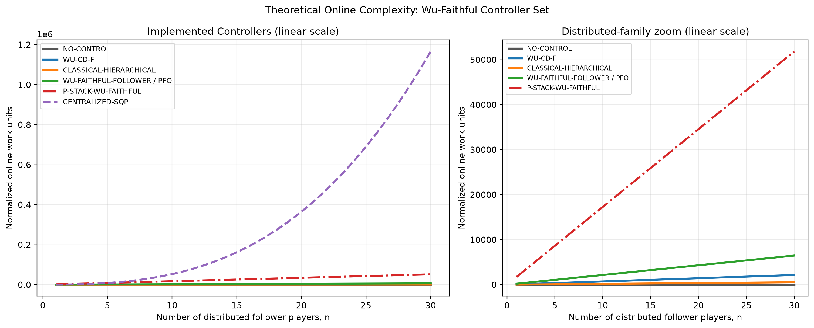

# Theoretical Controller Complexity Scaling

This note summarizes the theoretical online complexity of the current
Wu-faithful controller comparison as a function of the number of distributed
follower players `n`.

## Controller Set

The intended six-controller set here is:

| Controller | Role |
|---|---|
| `NO-CONTROL` | physical baseline |
| `WU-CD-F` | Wu-style distributed green/VSL controller |
| `CLASSICAL-HIERARCHICAL` | conventional hierarchical/gating reference |
| `WU-FAITHFUL-FOLLOWER` / `PROPOSED-FOLLOWERS-ONLY` | proposed distributed follower-only controller |
| `P-STACK-WU-FAITHFUL` / `PROPOSED-STACKELBERG` | low-dimensional leader plus Wu-faithful follower response |
| `CENTRALIZED-SQP` / `PROPOSED-CENTRALIZED` | Wu-style full-network centralized NLP/SQP benchmark |

## Symbols

| Symbol | Meaning |
|---|---|
| `n` | number of distributed follower players |
| `H` | prediction horizon / rollout length |
| `I` | Nash/Jacobi follower-response iterations |
| `c_W` | fixed local candidate count per Wu follower player |
| `c_F` | fixed local candidate count per Wu-faithful follower player |
| `L` | fixed Stackelberg leader candidate/evaluation count |
| `d` | centralized NLP decision-vector dimension, with `d = O(n)` |
| `S` | SLSQP major iteration count |

## Complexity Table

| Controller | Online decision structure | Theoretical work per control step |
|---|---|---:|
| `NO-CONTROL` | fixed physical no-control action | `O(1)` |
| `WU-CD-F` | distributed Wu follower response | `O(I * n * c_W * H)` |
| `CLASSICAL-HIERARCHICAL` | pressure/gating rules over local controllers | `O(n * H)` |
| `WU-FAITHFUL-FOLLOWER` / `PFO` | distributed local follower response with green/RM/VSL/offset candidates | `O(I * n * c_F * H)` |
| `P-STACK-WU-FAITHFUL` | low-dimensional leader targets, each evaluated through follower response | `O(L * I * n * c_F * H + L * n * H)` |
| `CENTRALIZED-SQP` | one full-network centralized NLP solved by SLSQP | approximately `O(S * (d * n * H + d^3))`, with `d = O(n)` |

Thus, under fixed local/leader budgets, `PFO` and `P-Stack` scale linearly in
the number of players, but `P-Stack` has a much larger constant because each
leader candidate requires a follower response. The centralized SQP benchmark is
not exponential like an exact discrete joint grid, but it is still superlinear:
with `d = O(n)`, numerical-gradient SLSQP can scale roughly as
`O(S * (n^2 H + n^3))`.

## Key Difference Between P-Stack and Centralized SQP

`CENTRALIZED-SQP` directly optimizes all full-network control variables in one
centralized decision vector. It follows the benchmarking philosophy of Wu et
al. (2022), where the centralized control scheme solves the whole mixed-network
optimization problem by a centralized SQP solver.

`P-STACK-WU-FAITHFUL` does not search the full actuator vector at the leader
level. The leader only searches aggregate coupling targets such as `N_P_star`
and `N_UF_star`; detailed green, offset, ramp-metering, and VSL decisions are
generated by distributed follower responses. This is a structural reduction of
the decision problem, not merely a fixed-budget truncation of a centralized
search.

## Visual Summary

Generated files:

- `reports/figures/theoretical_complexity/controller_complexity_scaling.png`
- `reports/figures/theoretical_complexity/controller_complexity_scaling.pdf`
- `reports/figures/theoretical_complexity/controller_complexity_scaling.csv`

The plotted figure uses a linear y-scale. The left panel shows all implemented
controllers, and the right panel zooms into the distributed-family controllers
so the large P-Stack constant is visible. The exact-joint-grid reference remains
in the CSV only; plotting it on a linear axis would dominate the scale and hide
all implemented controllers. It is not the implemented centralized benchmark
after the SLSQP change.

## Presentation Wording

Short English version:

> Following Wu et al. (2022), the centralized benchmark is treated as a
> full-network NLP solved by an SQP-type optimizer. It is a centralized
> performance reference, not a deployable large-scale online architecture. In
> contrast, P-Stack keeps the leader problem low-dimensional and delegates
> detailed actuator decisions to distributed follower responses, yielding linear
> scaling in the number of follower players under fixed local and leader
> budgets.

Korean version:

> Wu et al. (2022)와 같이 centralized benchmark는 전체 mixed network의
> control vector를 하나의 중앙 NLP로 묶고 SQP 계열 solver로 푸는 성능 기준선으로
> 해석한다. 반면 P-Stack은 leader가 `N_P_star`, `N_UF_star`와 같은 저차원
> coupling target만 선택하고, 세부 green/RM/VSL/offset은 distributed follower
> response가 결정한다. 따라서 centralized SQP처럼 전체 제어변수 벡터를 직접
> 최적화하는 것이 아니라, follower player 수에 대해 선형적으로 확장되는
> 계층형 분해 구조로 볼 수 있다.
